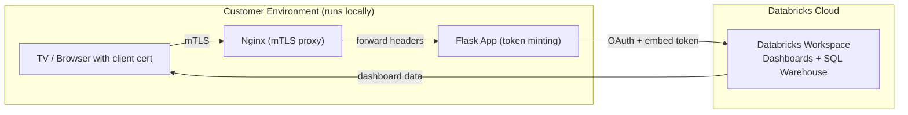
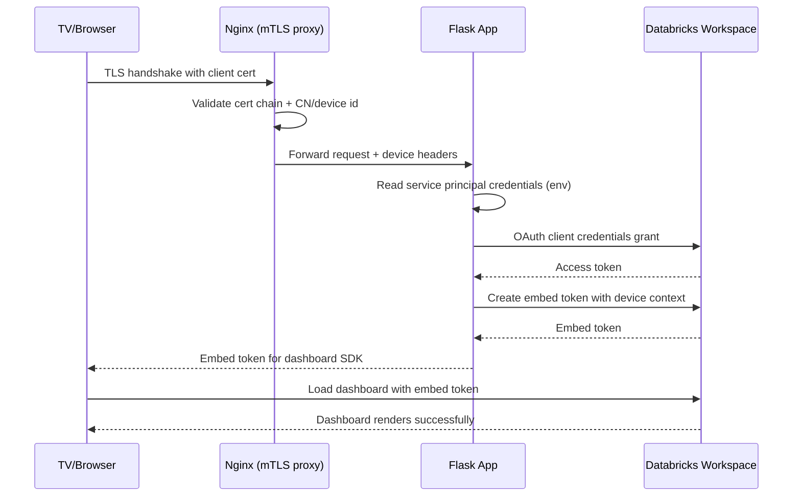

# AI/BI External Embedding Template

A minimal template showing how to embed Databricks dashboards into external applications using mTLS device authentication.


## What This Shows

- **mTLS Device Authentication**: Device identity verified via client certificates
- **OAuth Token Generation**: Backend creates device-scoped Databricks tokens
- **Dashboard Embedding**: Uses [@databricks/aibi-client SDK](https://www.npmjs.com/package/@databricks/aibi-client)
- **Parameter Passing**: Pass device context to dashboard queries via `external_value`

For more details on external embedding, see the [official documentation](https://docs.databricks.com/aws/en/dashboards/embedding/external-embed).

## Quick Start

### 1. Clone & Configure

```bash
git clone https://github.com/databricks-solutions/aibi-dashboards-external-embedding.git
cd aibi-dashboards-external-embedding
cp backend/.env.example backend/.env
```

Edit `backend/.env`:
```env
DATABRICKS_WORKSPACE_URL=https://your-workspace.cloud.databricks.com
DATABRICKS_CLIENT_ID=your-service-principal-client-id
DATABRICKS_CLIENT_SECRET=your-service-principal-secret
DATABRICKS_DASHBOARD_ID=your-dashboard-id
DATABRICKS_WORKSPACE_ID=your-workspace-id
```

**Finding values:**
- WORKSPACE_URL: Copy from browser
- CLIENT_ID/SECRET: Settings → Identity & Access → Service Principals → Generate Secret
- DASHBOARD_ID: From URL `/sql/dashboards/{ID}`
- WORKSPACE_ID: [AWS](https://docs.databricks.com/aws/en/workspace/workspace-details) | [Azure](https://learn.microsoft.com/en-us/azure/databricks/workspace/workspace-details) | [GCP](https://docs.databricks.com/gcp/en/workspace/workspace-details)

**Grant Service Principal permissions:**
1. Dashboard → Share → Add SP with "Can Run"
2. SQL Warehouse → Permissions → Add SP with "Can Use"
3. Catalog Explorer → Grant access on catalog/schema/tables

### 2. Generate Certificates & Start

```bash
./backend/scripts/generate-mtls-certs.sh
docker compose up -d --build
```

### 3. Install Client Certificate (macOS)

```bash
# Create browser-compatible cert
openssl pkcs12 -export \
  -in certs/factory-tv-01.crt \
  -inkey certs/factory-tv-01.key \
  -out certs/factory-tv-01.p12 \
  -name "factory-tv-01"

# Import to Keychain
open certs/factory-tv-01.p12

# Trust CA (optional, prevents warnings)
open certs/ca.crt  # In Keychain: Trust → Always Trust

# Restart browser!
```

### 4. Access Dashboard

Open http://localhost:3000, select the **factory-tv-01** certificate when prompted.

## How It Works

```
Browser (with client cert) 
    → Nginx (verifies cert, forwards headers)
    → Flask (mints token with device context)
    → Databricks (serves dashboard with RLS)
```





**Key files:**
- `backend/app.py` - Token minting & mTLS validation
- `backend/nginx-mtls.conf` - mTLS proxy config
- `frontend/src/App.jsx` - Main UI
- `frontend/src/components/DashboardEmbed.jsx` - SDK integration

## Testing Parameters in Databricks

Use this query in your dashboard to test that `external_value` is being passed correctly:

```sql
SELECT
  COALESCE(NULLIF(__aibi_external_value, ''), :tenant_value_fallback) AS external_value
```

This query returns the `external_value` passed from your application, or falls back to a parameter if the value is empty.

## Development

```bash
# Start services (with hot reload)
docker compose up -d --build
docker compose logs -f

# Edit code - changes apply automatically:
# - Frontend: Instant (Vite HMR)
# - Backend: ~2-3s restart (Flask auto-reload)
```

## License

© 2025 Databricks, Inc. See [LICENSE.md](LICENSE.md).

## Support

This is not covered by Databricks support. For issues, [open a GitHub issue](https://github.com/databricks-solutions/aibi-dashboards-external-embedding/issues).
